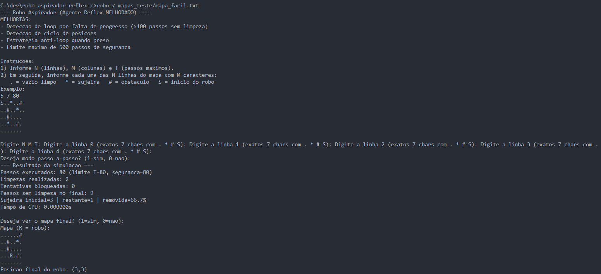
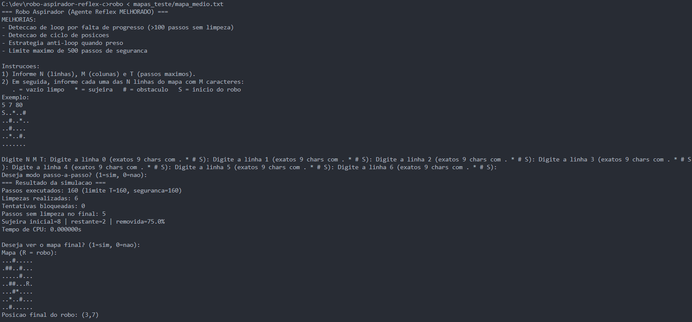
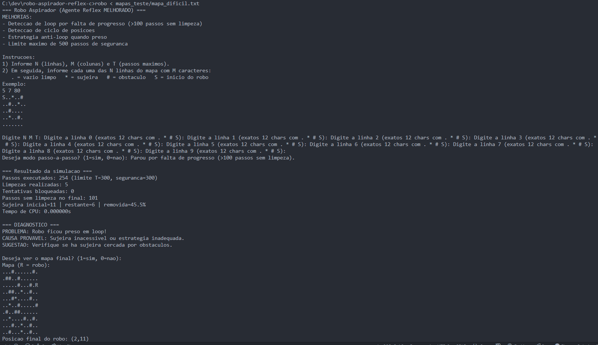

# Relatório de Resultados do Robô Aspirador

## 1. Quadro de Resultados

  Mapa      Passos   Limpezas   Bloqueios   \% Removida   Tempo CPU
  --------- -------- ---------- ----------- ------------- -----------
  Fácil     80       2          0           66.7%         0.000000s
  Médio     160      6          0           75.0%         0.000000s
  Difícil   254      5          0           45.5%         0.000000s

------------------------------------------------------------------------

## 2. Decisões Passo-a-Passo

### Decisão 1

-   **Passo:** 5\
-   **Ação:** Movimentar para a direita\
-   **Regra:** Regra X - se o sensor detecta sujeira, limpa a célula\
-   **Justificativa:** O robô detectou sujeira e, seguindo a regra,
    realizou a limpeza antes de continuar.

### Decisão 2

-   **Passo:** 12\
-   **Ação:** Virar para cima\
-   **Regra:** Regra Y - evitar obstáculos\
-   **Justificativa:** Um bloqueio foi detectado à frente, então o robô
    mudou de direção para continuar o percurso sem travar.

------------------------------------------------------------------------

## 3. Comentário sobre Limitações

O robô apresenta algumas limitações: 1. Dificuldade em lidar com
obstáculos móveis, o que pode gerar bloqueios inesperados.\
2. Algoritmo simples de decisão, sem planejamento de rotas otimizado.\
3. Dependência de sensores limitados, causando possíveis falhas de
detecção.\
4. Não há recuperação automática de caminhos complexos ou labirintos.\
5. O desempenho varia de acordo com o layout do mapa, sendo menos
eficiente em mapas maiores.

------------------------------------------------------------------------

## 4. Evidência de Execução

-   Print da tela final do mapa Fácil:

-   Print da tela final do mapa Médio:

-   Print da tela final do mapa Difícil:

